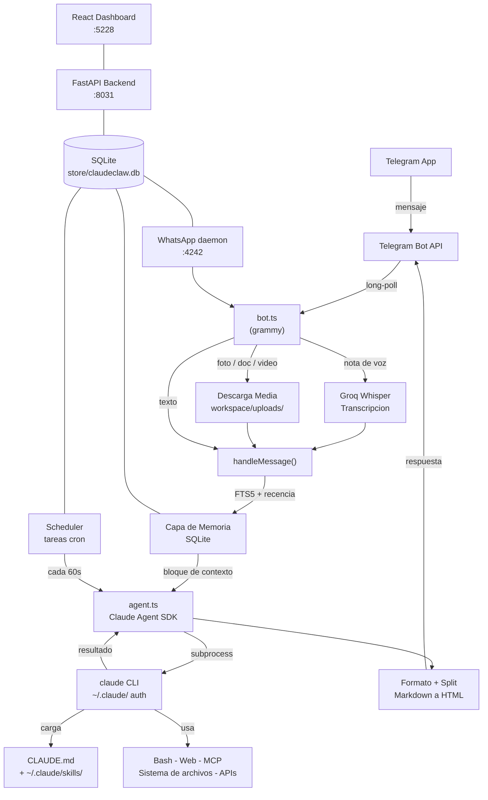

# ClaudeClaw

```
 ██████╗██╗      █████╗ ██╗   ██╗██████╗ ███████╗
██╔════╝██║     ██╔══██╗██║   ██║██╔══██╗██╔════╝
██║     ██║     ███████║██║   ██║██║  ██║█████╗
██║     ██║     ██╔══██║██║   ██║██║  ██║██╔══╝
╚██████╗███████╗██║  ██║╚██████╔╝██████╔╝███████╗
 ╚═════╝╚══════╝╚═╝  ╚═╝ ╚═════╝ ╚═════╝╚══════╝

 ██████╗██╗      █████╗ ██╗    ██╗
██╔════╝██║     ██╔══██╗██║    ██║
██║     ██║     ███████║██║ █╗ ██║
██║     ██║     ██╔══██║██║███╗██║
╚██████╗███████╗██║  ██║╚███╔███╔╝
 ╚═════╝╚══════╝╚═╝  ╚═╝ ╚══╝╚══╝
```

> Tu CLI de Claude Code, entregado a tu telefono via Telegram.

ClaudeClaw no es un wrapper de chatbot. Ejecuta el CLI real de `claude` en tu Mac o Linux y envía el resultado a tu chat de Telegram. Todo lo que funciona en tu terminal (tus skills, tus herramientas, tu contexto) funciona desde tu telefono.

---

## Que hace el proyecto

ClaudeClaw es un asistente personal basado en Claude Code, accesible via Telegram. Funciona como un servicio persistente en tu maquina (Mac, Linux o Windows) y te permite:

- Enviar mensajes de texto, fotos, documentos y videos desde Telegram y recibir respuestas inteligentes
- Usar notas de voz (transcripcion via Groq Whisper + respuestas en audio via ElevenLabs)
- Programar tareas automaticas con cron
- Conectar WhatsApp y Slack como canales adicionales
- Mantener memoria persistente con SQLite (FTS5) que aprende de tus conversaciones
- Dashboard web con metricas, calendario, correo y configuracion
- Agentes advisor con Gemini 2.5 Flash para analisis de negocio

---

## Arquitectura



### Componentes principales

| Componente | Tecnologia | Descripcion |
|-----------|-----------|-------------|
| **Bot Telegram** (`src/`) | TypeScript, grammy | Bot principal. Recibe mensajes, ejecuta Claude Code, responde |
| **Backend API** (`api/`) | Python, FastAPI | API REST con 15 modulos: pulse, advisors, scheduler, tareas, notas |
| **Dashboard** (`dashboard/`) | React 19, Vite, Tailwind | UI web con metricas, calendario, correo, configuracion |
| **Base de datos** | SQLite | Todo en `store/claudeclaw.db` (bot) y `api/claudeclaw.db` (API) |

### Estructura del proyecto

```
claudeclaw/
├── src/                      # Bot Telegram (TypeScript)
│   ├── index.ts              # Punto de entrada
│   ├── bot.ts                # Logica principal del bot
│   ├── agent.ts              # Integracion con Claude Code
│   ├── advisor.ts            # Agentes advisor (Gemini)
│   ├── autopilot.ts          # Flujos automaticos
│   ├── db.ts                 # Operaciones SQLite
│   ├── memory.ts             # Memoria semantica y episodica
│   ├── scheduler.ts          # Tareas cron
│   ├── voice.ts              # Voz (Groq STT + ElevenLabs TTS)
│   ├── media.ts              # Descarga de archivos Telegram
│   ├── slack.ts              # Cliente Slack
│   ├── whatsapp.ts           # Puente WhatsApp
│   └── *.test.ts             # Tests unitarios (vitest)
├── api/                      # Backend (FastAPI)
│   ├── main.py               # Punto de entrada
│   ├── database.py           # Configuracion SQLite
│   ├── models.py             # Modelos Pydantic
│   ├── api_tools.py          # Definiciones de herramientas para agentes
│   ├── routers/              # 15 modulos de endpoints
│   │   ├── advisor.py        # Agentes advisor con function calling
│   │   ├── pulse_today.py    # Metricas diarias
│   │   ├── pulse_briefing.py # Briefing matutino
│   │   ├── pulse_urgent.py   # Alertas urgentes
│   │   ├── scheduler.py      # Programacion de tareas
│   │   └── ...               # journal, notes, tasks, projects, etc.
│   ├── tests/                # Tests pytest
│   └── requirements.txt      # Dependencias Python
├── dashboard/                # Frontend React
│   ├── src/
│   │   ├── pages/            # Paginas (Calendar, Correo, Pulse, Scheduler)
│   │   ├── components/       # Componentes UI
│   │   └── App.tsx
│   └── package.json
├── skills/                   # Skills incluidos (copiar a ~/.claude/skills/)
│   ├── gmail/
│   ├── google-calendar/
│   └── slack/
├── scripts/                  # Utilidades
│   ├── setup.ts              # Wizard de configuracion
│   ├── status.ts             # Health check
│   ├── notify.sh             # Notificaciones Telegram desde shell
│   └── wa-daemon.ts          # Daemon WhatsApp
├── CLAUDE.md                 # Personalidad y contexto del asistente
├── package.json              # Scripts npm y dependencias
└── .env                      # Claves API (gitignored)
```

---

## Instalacion

### Requisitos previos

| Requisito | Notas |
|-----------|-------|
| **Node.js 20+** | Verificar: `node --version`. Descargar en [nodejs.org](https://nodejs.org) |
| **Python 3.10+** | Para el backend FastAPI |
| **Claude Code CLI** | Instalar: `npm i -g @anthropic-ai/claude-code` |
| **Cuenta de Claude** | Iniciar sesion: `claude login` |
| **Cuenta de Telegram** | Cualquier cuenta existente |

### Pasos

```bash
# 1. Clonar el repositorio
git clone https://github.com/earlyaidopters/claudeclaw.git
cd claudeclaw

# 2. Instalar dependencias Node
npm install

# 3. Instalar dependencias Python
pip install -r api/requirements.txt

# 4. Instalar dependencias del Dashboard
cd dashboard && npm install && cd ..

# 5. Ejecutar el wizard de configuracion (interactivo)
npm run setup
```

El wizard de configuracion:
- Verifica tu entorno (Node, Claude CLI, compila si es necesario)
- Te pregunta que features quieres (voz, video, WhatsApp)
- Abre tu editor para personalizar `CLAUDE.md`
- Pide las API keys solo para las features que seleccionaste
- Instala el servicio en background (launchd en macOS, systemd en Linux, PM2 en Windows)

### Crear un bot de Telegram

1. Abre Telegram y busca **@BotFather**
2. Envia `/newbot`
3. Sigue las instrucciones y copia el token (formato: `1234567890:AAFxxxxxxx`)
4. Agrega el token a tu `.env`:
   ```
   TELEGRAM_BOT_TOKEN=tu_token_aqui
   ```

### Obtener tu Chat ID

1. Inicia el bot: `npm start`
2. Enviale un mensaje en Telegram
3. Envia `/chatid`
4. Agrega el numero a `.env`:
   ```
   ALLOWED_CHAT_ID=tu_numero_aqui
   ```
5. Reinicia el bot

---

## Como ejecutar

### Desarrollo

```bash
# Bot de Telegram (modo desarrollo con hot-reload)
npm run dev

# Backend API (puerto 8031)
cd api && uvicorn main:app --host 0.0.0.0 --port 8031

# Dashboard (puerto 5228)
cd dashboard && npm run dev
```

### Produccion

```bash
# Compilar TypeScript
npm run build

# Iniciar bot compilado
npm start

# O iniciar todo (dashboard + API)
npm run start:all
```

### Servicio en background

**macOS** (launchd):
```bash
npm run setup   # Instala automaticamente
tail -f /tmp/claudeclaw.log
```

**Linux** (systemd):
```bash
systemctl --user status claudeclaw
journalctl --user -u claudeclaw -f
```

**Windows** (PM2):
```bash
npm install -g pm2
pm2 start dist/index.js --name claudeclaw
pm2 save && pm2 startup
```

### Health check

```bash
npm run status
```

---

## Variables de entorno

### Requeridas

| Variable | Descripcion |
|----------|-------------|
| `TELEGRAM_BOT_TOKEN` | Token del bot de [@BotFather](https://t.me/botfather) |
| `ALLOWED_CHAT_ID` | Tu chat ID de Telegram (envia `/chatid` para obtenerlo) |

### Opcionales - Core

| Variable | Descripcion |
|----------|-------------|
| `INTERNAL_API_KEY` | Clave compartida para autenticacion server-to-server entre bot y API |
| `API_PORT` | Puerto del backend (default: `8031`) |
| `ANTHROPIC_API_KEY` | Usar pago por token en vez de suscripcion Max |
| `CLAUDE_CODE_OAUTH_TOKEN` | Override de cuenta Claude |

### Opcionales - Voz

| Variable | Descripcion |
|----------|-------------|
| `GROQ_API_KEY` | Transcripcion de voz via Whisper ([console.groq.com](https://console.groq.com)) |
| `ELEVENLABS_API_KEY` | Sintesis de voz ([elevenlabs.io](https://elevenlabs.io)) |
| `ELEVENLABS_VOICE_ID` | ID de tu voz clonada en ElevenLabs |
| `VOICE_ARTURO`, `VOICE_ELENA`, etc. | Voces por agente advisor |

### Opcionales - Integraciones

| Variable | Descripcion |
|----------|-------------|
| `GOOGLE_API_KEY` | Gemini para analisis de video y agentes advisor ([aistudio.google.com](https://aistudio.google.com)) |
| `SLACK_USER_TOKEN` | Token OAuth de usuario Slack (formato `xoxp-`) |
| `GOOGLE_CREDS_PATH` | Ruta a credentials.json de Google OAuth |
| `GMAIL_TOKEN_PATH` | Ruta al token OAuth de Gmail |
| `GCAL_TOKEN_PATH` | Ruta al token OAuth de Calendar |
| `WHATSAPP_ENABLED` | `true` para habilitar el puente WhatsApp |

---

## Tests

### Tests de Python (pytest)

```bash
# Ejecutar todos los tests
python -m pytest api/tests/ -v

# Ejecutar un archivo especifico
python -m pytest api/tests/test_pulse_today.py -v

# Con cobertura
python -m pytest api/tests/ --cov=api
```

Archivos de test:
- `api/tests/test_pulse_today.py` - Tests de metricas diarias, historial, advisors overnight
- `api/tests/test_pulse_briefing.py` - Tests del briefing matutino (clima, frase, newsletter)
- `api/tests/test_pulse_urgent.py` - Tests de alertas urgentes (stockouts, aprobaciones)

### Tests de TypeScript (vitest)

```bash
# Ejecutar todos los tests
npm test

# Modo watch
npm run test:watch

# Con cobertura
npm run test:coverage
```

Archivos de test:
- `src/bot.test.ts` - Funcionalidad core del bot
- `src/db.test.ts` - Capa de base de datos
- `src/env.test.ts` - Parsing de variables de entorno
- `src/media.test.ts` - Manejo de media (imagenes, video)
- `src/memory.test.ts` - Memoria semantica
- `src/voice.test.ts` - Entrada/salida de voz

### Type checking

```bash
npm run typecheck
```

---

## Funcionalidades principales

### Mensajeria

| Feature | Funciona | Notas |
|---------|----------|-------|
| Texto | Si | Claude Code completo con todas las herramientas |
| Fotos | Si | Claude analiza imagenes |
| Documentos | Si | PDF, codigo, texto |
| Notas de voz | Requiere `GROQ_API_KEY` | Transcripcion con Whisper |
| Respuestas de voz | Requiere `ELEVENLABS_API_KEY` | Voz clonada |
| Video | Requiere `GOOGLE_API_KEY` | Analisis via Gemini |

### Memoria persistente

Tres capas de contexto automaticas:

1. **Reanudacion de sesion** - Claude mantiene contexto completo entre mensajes
2. **Memoria SQLite con FTS5** - Memorias semanticas (preferencias) y episodicas (conversaciones)
3. **Inyeccion de contexto** - Busqueda FTS5 + recencia antes de cada mensaje

### Tareas programadas

```bash
# Crear tarea
node dist/schedule-cli.js create "resumir noticias de AI" "0 9 * * 1"

# Listar tareas
node dist/schedule-cli.js list

# Pausar/reanudar/eliminar
node dist/schedule-cli.js pause <id>
node dist/schedule-cli.js resume <id>
node dist/schedule-cli.js delete <id>
```

### Comandos del bot

| Comando | Funcion |
|---------|---------|
| `/start` | Confirmar que el bot esta online |
| `/chatid` | Obtener tu chat ID |
| `/newchat` | Iniciar sesion fresca |
| `/respin` | Recuperar ultimos 20 turnos como contexto |
| `/voice` | Activar/desactivar modo voz |
| `/memory` | Ver memorias recientes |
| `/forget` | Limpiar sesion actual |
| `/wa` | Interfaz WhatsApp |
| `/slack` | Interfaz Slack |

### WhatsApp (opcional)

No necesita API key. Usa tu cuenta existente via Linked Devices:

```bash
# Iniciar daemon
npx tsx scripts/wa-daemon.ts
# Escanear QR desde WhatsApp > Linked Devices
```

### Slack (opcional)

Requiere un User OAuth Token. Ver instrucciones completas de configuracion en la [documentacion de Slack](#slack-setup).

---

## Dashboard Web

El dashboard corre en el puerto 5228 y ofrece:

- **Business Pulse** - Metricas WoW/YoY con cards visuales
- **Calendario** - Vista de calendario integrada
- **Correo** - Gestion de correo
- **Pulse Config** - Configuracion de metricas
- **Scheduler** - Administracion de tareas programadas

---

## Seguridad

- El bot ejecuta Claude Code con `bypassPermissions` (necesario porque no hay terminal para aprobar). Solo es seguro cuando el bot esta bloqueado a tu chat ID
- `ALLOWED_CHAT_ID` debe configurarse inmediatamente. Sin el, el bot responde a cualquier usuario
- El daemon de WhatsApp solo escucha en `127.0.0.1`
- `notify.sh` puede ser llamado por Claude con cualquier contenido (por disenio)

---

## Scripts disponibles

```bash
npm run setup         # Wizard interactivo de configuracion
npm run status        # Health check completo
npm run build         # Compilar TypeScript a dist/
npm start             # Ejecutar bot compilado (produccion)
npm run dev           # Ejecutar con tsx (desarrollo)
npm test              # Ejecutar tests (vitest)
npm run test:watch    # Tests en modo watch
npm run test:coverage # Tests con reporte de cobertura
npm run typecheck     # Type-check sin compilar
npm run build:dashboard  # Compilar dashboard
npm run start:all     # Compilar dashboard + iniciar API
```

---

## Licencia

MIT
